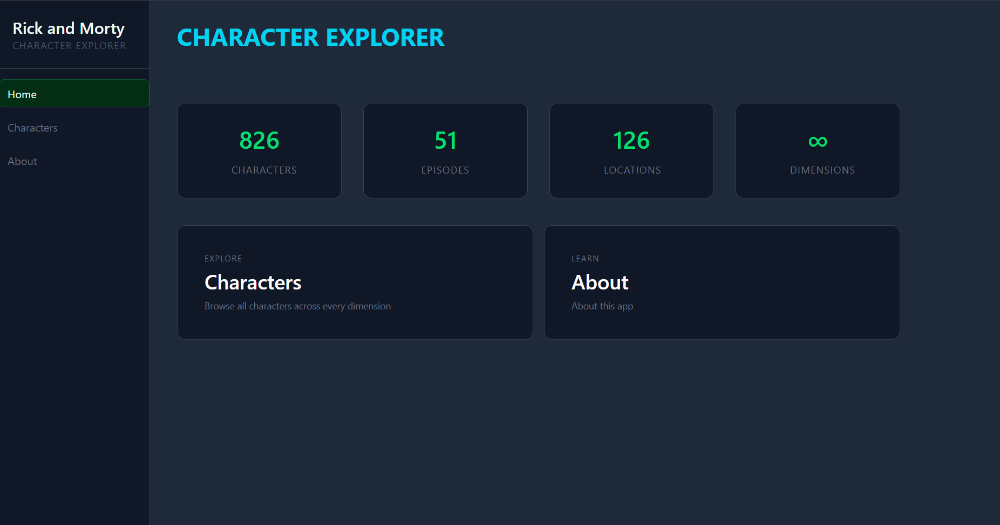
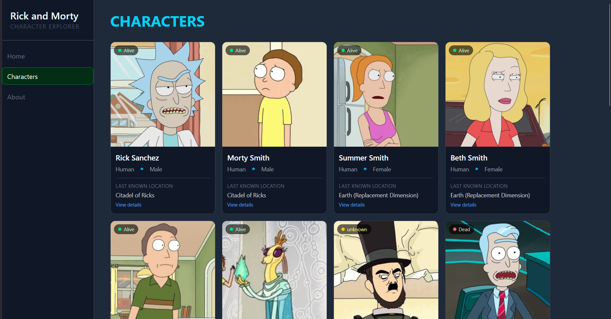

# Character Explorer — Rick & Morty

Character Explorer is a React app for browsing and exploring characters from the Rick and Morty universe. The project is built with React and Tailwind CSS as a component-based single-page application powered by Vite. All data is fetched live from the public Rick and Morty REST API.

## Contributor

Isaac Ndungu


## Project Brief

Character Explorer is a routing-focused React application designed to demonstrate basic routing, dynamic routing, and nested routing using real API data. The app lets users browse all Rick and Morty characters, view individual character details, and explore character-specific info and episode appearances through nested routes.


## Core Features

### Character Browser
- Grid display of all characters with name, image, status, species, gender, and last known location
- Each card links directly to the character's detail page

### Character Detail
- Dynamic route `/characters/:id` displays a single character's image, name, species, and gender
- Tabbed navigation between Info and Episodes nested routes

### Character Info
- Displays status, species, gender, origin, location, and type for the selected character

### Character Episodes
- Fetches and lists every episode the character appeared in
- Shows episode code, name, and air date

### Sidebar Navigation
- Fixed sidebar with links to Home, Characters, and About
- Active route highlighted automatically using NavLink

### Dashboard Home
- Overview stats — total characters, episodes, locations, and dimensions
- Quick link cards to the Characters and About pages

### About Page
- App description, tech stack, and full route map


## Technologies Used

- React Router DOM v6
- Tailwind CSS
- Vite
- Rick and Morty API (rickandmortyapi.com)
- JavaScript (ES6+)


## Usage Instructions

1. Clone the repository

```bash
git@github.com:isaac-ndungu/character-explorer.git
```

2. Install dependencies

```bash
npm install
```

3. Start the development server

```bash
npm run dev
```

4. Open your browser and navigate to `http://localhost:5173`


## Screenshots




## Future Improvements

- Search and filter on the characters page
- Pagination to browse beyond the first 20 characters
- Loading skeletons instead of plain loading text
- Filter characters by status, species, or gender
- Locations page using the `/api/location` endpoint